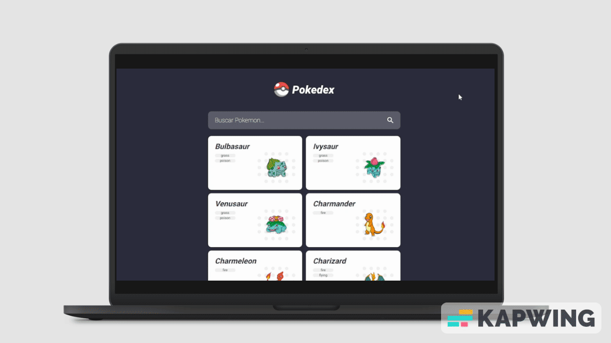

# Pokedex




# Índice
- [Sobre](#-sobre)
- [Link](#-link)
- [Como baixar o projeto](#-como-baixar-o-projeto)


---

## 📄 Sobre

### Uma aplicação feita em [Angular](https://angular.io/), no [Curso de Angular 2 (v15+) Typescript do Básico ao Avançado](https://www.udemy.com/course/curso-de-angular/). Trata-se de uma página que consome dados da [PokeAPI](https://pokeapi.co/), listando pokemons e suas habilidades. 
---
## 🔗 Link

### Você pode acessar e testar  [clicando aqui](https://gabriel-santana.github.io/curso-angular-pokedex/).

---

## ⬇ Como baixar o projeto

```bash
# Clonar o repositório
$ git clone https://github.com/gabriel-santana/curso-angular-pokedex.git

# Entrar no diretório
$ cd .\curso-angular-pokedex\

# Instalar as dependências
$ npm i

# Iniciar o projeto
$ ng s

```
